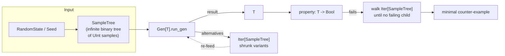
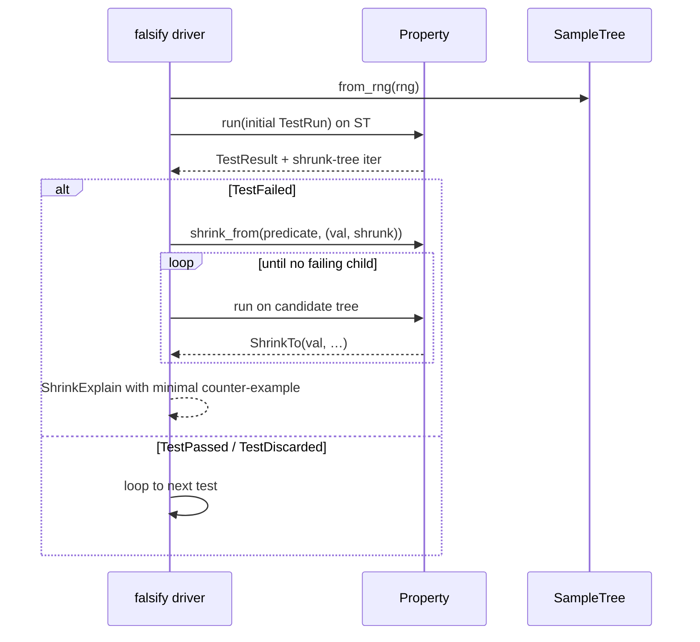

# Falsify — Internal Shrinking, Reimagined

A MoonBit port of Edsko de Vries's **falsify** library for Haskell: random
property-based testing where shrinking is *derived from the generator* —
so for generators built from the safe combinators (`pure`, `fmap`, `bind`,
`ap`, `select`, `prim`, …), the shrinker can only produce values the
generator itself could produce, at no extra code cost.

> "Free shrinkers" means you never again write (or forget to write) a
> `Shrink` instance that silently produces values outside your generator's
> support. The property holds for the safe combinator set; escape hatches
> like `new`, `prim_with`, and `shrink_to_list` let you opt out, at which
> point it is up to you to keep the shrink set inside the support.

## The big idea

Classical QuickCheck separates generation (`Gen`) from shrinking (`Shrink`).
The two have to agree, and keeping them in sync is a known source of bugs.
Falsify replaces `Gen[T]` with a function:

```moonbit nocheck
///|
struct Gen[T] {
  run_gen : (SampleTree) -> (T, Iter[SampleTree])
}
```

A `SampleTree` is an infinite binary tree of random `UInt`s. To generate a
value, a `Gen` *consumes a prefix of the tree*. To shrink, Falsify edits the
tree (replacing `NotShrunk(u)` with `Shrunk(u')` at various positions) and
re-runs the same `Gen`. Because the generator is *deterministic given a
SampleTree*, the shrunk tree always produces an in-support value.



## Install

```bash
moon add moonbitlang/quickcheck
```

```json
{
  "import": [
    { "path": "moonbitlang/quickcheck/falsify", "alias": "falsify" }
  ]
}
```

---

## `SampleTree` — the source of randomness

You rarely construct a `SampleTree` yourself; the driver builds one from an
`@splitmix.RandomState`. But the operations are public, and understanding
them makes the rest of the API click.

| Constructor | What you get |
|-------------|--------------|
| `from_seed(seed)` | A deterministic tree seeded from a `UInt64` |
| `from_rng(rs)` | A tree seeded from a given splittable `RandomState` |
| `constant(u)` | Every node is `u` (useful for tests and replaying) |

| Operation | What it does |
|-----------|--------------|
| `view(t)` | Unpack into `(Sample, left-subtree, right-subtree)` |
| `t.map(f)` | Map `f` over every `UInt` in the tree |
| `t.mod(u)` | Shortcut for `t.map(x => x % u)` |

```moonbit nocheck
///|
test "constant sample tree yields constant values" {
  let t = @falsify.constant(42)
  let (s, _l, _r) = t.view()
  assert_eq(s.sample_value(), 42)
}

///|
test "mod clamps sampled values to a range" {
  let t = @falsify.constant(97).mod(10)
  let (s, _l, _r) = t.view()
  assert_eq(s.sample_value(), 7)
}
```

> The sample-tree constructors (`constant`, `from_seed`, `from_rng`) build
> their children eagerly in the current implementation. In practice the
> driver owns the tree and only the driver needs to construct one; user
> code works at the `Gen[T]` level and never touches `SampleTree`
> directly.

---

## `Gen[T]` — generators over a sample tree

A `Gen[T]` is a deterministic decoder from `SampleTree` to `T`, plus the set
of **shrunk sample trees** the driver should try next if a failure is
observed.

### Primitives

| Name | Signature | Notes |
|------|-----------|-------|
| `pure(v)` | `T -> Gen[T]` | No randomness, no shrinks |
| `prim()` | `() -> Gen[UInt]` | Reads one `UInt` from the tree's root |
| `prim_with(f)` | `(Sample -> Iter[UInt]) -> Gen[Sample]` | Custom shrink set |
| `new(f)` | `((SampleTree) -> (T, Iter[SampleTree])) -> Gen[T]` | Escape hatch |
| `shrink_to_list(v, iter)` | `T -> Iter[T] -> Gen[T]` | Fixed value whose shrinks are the given iter |

### Functorial / monadic / applicative composition

```moonbit nocheck
fn[T, U] Gen::fmap(self : Gen[T], f : (T) -> U) -> Gen[U]
fn[T, U] Gen::bind(self : Gen[T], f : (T) -> Gen[U]) -> Gen[U]
fn[T, U] Gen::ap  (self : Gen[(T) -> U], g : Gen[T]) -> Gen[U]
```

A **selective applicative** layer (`select`, `apS`, `branch`, `ifS`) is also
exposed, which lets the driver reason about *which* sub-tree a generator
actually depended on — the shrinker uses this to prune alternatives that
can't possibly affect the result.

```moonbit nocheck
///|
test "pure is a constant generator" {
  let g = @falsify.pure(99)
  // Drive the generator against a sample tree and read the value.
  let (v, _shrinks) = g.run_gen(@falsify.constant(0))
  assert_eq(v, 99)
}

///|
test "fmap transforms generated values" {
  let g = @falsify.pure(10).fmap(x => x * 2)
  let (v, _shrinks) = g.run_gen(@falsify.constant(0))
  assert_eq(v, 20)
}
```

```mbt check
///|
test "Gen types compose at the type level" {
  // These don't run — we just pin the signatures so stale imports break CI.
  let _pure : @falsify.Gen[Int] = @falsify.pure(42)
  let _fmap : @falsify.Gen[String] = @falsify.pure(42).fmap(x => x.to_string())
  let _prim : @falsify.Gen[UInt] = @falsify.prim()
  ignore(_pure)
  ignore(_fmap)
  ignore(_prim)
}
```

> `shrink_to_list(v, xs)` is present in the API surface but its `NotShrunk`
> branch is currently a `todo` — it is stubbed pending integration with the
> `prim_with` pipeline. Stick to `pure`/`fmap`/`bind`/`prim` for now.

---

## `Property[T, E]` — things the driver can test

A `Property[T, E]` wraps a `Gen[(TestResult[T, E], TestRun)]`, so it carries
not just a verdict but a *run log* (collected labels, informational messages,
whether the property is deterministic, …).

The quickest path is `test_gen(predicate, gen)`:

```moonbit nocheck
pub fn[T] test_gen(f : (T) -> Bool, gen : Gen[T]) -> Property[T, String]
```

Then hand the property to the `falsify` driver with a `Config`:

```moonbit nocheck
///|
test "falsify passes a trivially-true property" {
  let cfg : @falsify.Config = Default::default()
  let prop = @falsify.test_gen(_x => true, @falsify.pure(7))
  let (_rng, _successes, _discarded, failure) = @falsify.falsify(cfg, prop)
  assert_true(failure is None)
}

///|
test "falsify reports a failure for a false property" {
  let cfg : @falsify.Config = Default::default()
  let prop = @falsify.test_gen(x => x != 7, @falsify.pure(7))
  let (_rng, _successes, _discarded, failure) = @falsify.falsify(cfg, prop)
  assert_true(failure is Some(_))
}
```

### Extra property combinators

| Combinator | Signature | Use |
|------------|-----------|-----|
| `gen(f, g)` | `(T -> String?) -> Gen[T] -> Property[T, E]` | Generator wrapped into a property; `f` controls logging |
| `info(msg)` | `String -> Property[Unit, String]` | Add a line to the run log |
| `discard()` | `() -> Property[T, E]` | Skip this test case |
| `label(l, vs)` | `String -> List[String] -> Property[Unit, E]` | Classify for distribution reporting |
| `collect(l, vs)` | `String -> List[T] -> Property[Unit, E]` | `label` for `Show`-able values |

---

## Shrinking — `ShrinkExplain[P, N]`

After a failure, `falsify` returns a `Failure[E]` containing a
`ShrinkExplain[(E, TestRun), TestRun]`. This is a record of the whole shrink
search: every successful step, plus the *negative evidence* (alternatives
that were considered but rejected) at the final step.

| Method | Returns | Use |
|--------|---------|-----|
| `limit_steps(Some(n))` | `ShrinkExplain[P, N]` | Bound the history before logging |
| `shrink_history()` | `Array[P]` | All values visited, in order |
| `shrink_outcome()` | `(P, Iter[N]?)` | Final value, plus negative evidence if search ended naturally |



---

## Minimal end-to-end example

Let's prove to the driver that addition is **not** commutative if we
deliberately use subtraction instead — and watch it report the failure.

```moonbit nocheck
///|
test "driver reports the failure cleanly" {
  let cfg : @falsify.Config = Default::default()

  // A buggy "commutativity" check.
  let prop = @falsify.test_gen(
    p => {
      let (a, b) = p
      a - b == b - a
    },
    @falsify.pure((3, 5)),
  )

  let (_rng, _successes, _discarded, failure) = @falsify.falsify(cfg, prop)
  guard failure is Some(_) else { fail("expected a falsified result") }
}
```

For real use, you'd hand the driver a `Gen` that actually varies (using
`prim`, `shrink_to_list`, or a composed generator) and rely on the built-in
shrinker to minimize the counter-example.

---

## API Reference

### Values

| Name | Purpose |
|------|---------|
| `falsify(cfg, prop)` | Run the driver; returns `(rng, successes, discards, failure?)` |
| `init_state(cfg)` / `init_test_run()` | Construct the initial driver/test state |
| `test_gen(f, g)` / `gen(f, g)` | Convert a generator into a property |
| `pure(v)` / `prim()` / `prim_with(f)` / `new(f)` | Construct a `Gen[T]` |
| `shrink_to_list(v, iter)` | Gen of a fixed value with explicit shrink set |
| `from_seed(u)` / `from_rng(r)` / `constant(u)` | Construct a `SampleTree` |
| `combine_shrunk` | Compose two shrunk-tree iters; used internally by `bind` |
| `info(s)` / `label(l, vs)` / `collect(l, vs)` / `discard()` | Property combinators |
| `mk_property(f)` / `run_property(p)` | Low-level property plumbing |
| `second(f, v)` | Map the second element of a pair |

### Types

| Type | Purpose |
|------|---------|
| `Config` (with `Default`) | Tuning knobs for the driver |
| `Gen[T]` | A generator; monadic + selective applicative |
| `Property[T, E]` | A test predicate + run log |
| `Sample` / `SampleTree` | The source of randomness |
| `TestResult[T, E]` / `TestRun` | What a property yields |
| `Success[T]` / `Failure[E]` | Per-test outcomes surfaced by the driver |
| `DriverState[T]` | Internal state of a `falsify` run |
| `ShrinkExplain[P, N]` / `IsValidShrink[P, N]` | Shrink-history inspection |
| `Either[L, R]` | Used by the selective combinators |

## References

- Edsko de Vries. _falsify: Internal Shrinking Reimagined for Haskell._
  Haskell Symposium 2023. DOI
  [10.1145/3609026.3609733](https://doi.org/10.1145/3609026.3609733).
- Andrey Mokhov _et al._ _Selective applicative functors._ ICFP 2019. DOI
  [10.1145/3342521](https://doi.org/10.1145/3342521).

## License

Apache-2.0.
