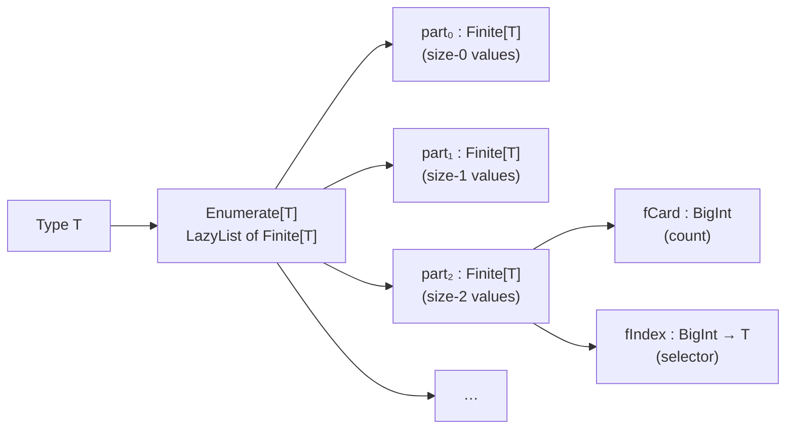
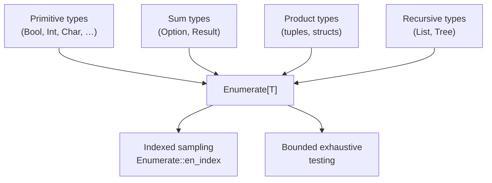

# Feat — Functional Enumeration of Algebraic Types

A MoonBit port of the ideas from _Feat: functional enumeration of algebraic
types_ (Duregård, Jansson, Wang, 2012). Feat turns an algebraic type into a
**bijection between the non-negative integers and its values**, so you can
enumerate, index, and sample finite parts of arbitrarily large types without
ever materializing the whole set.

> **Size notion.** In this README "size" means whatever the `Enumerable`
> instance chooses — usually one `pay` per constructor, but a user-defined
> instance can charge differently. The driver only relies on: each part
> is finite, parts are ordered by increasing size, and recursion is
> productive (guaranteed by `pay`).

> This package is a building block for MoonBit QuickCheck. It backs the
> "small check" mode (exhaustive testing for small sizes) and is independently
> useful whenever you want a deterministic, size-indexed view of a type.

## Why enumeration?

Random testing (QuickCheck) and exhaustive testing (SmallCheck) are two sides
of the same coin:

- **Random** is cheap, finds bugs lurking behind large inputs, but misses
  corner cases clustered near the "small" end of the space.
- **Exhaustive** catches every small-input bug but blows up combinatorially.

Feat's `Enumerate[T]` interleaves both: values are partitioned by a
user-chosen notion of **size**, so you can pick out the `i`-th value
overall or the `j`-th value at size `k` — deterministically, without
running the generator from the start.



## Install & Import

`feat` lives inside `moonbitlang/quickcheck`. Add the main package and then
import the sub-package in your `moon.pkg.json`:

```bash
moon add moonbitlang/quickcheck
```

```json
{
  "import": [
    { "path": "moonbitlang/quickcheck/feat", "alias": "feat" }
  ]
}
```

---

## The two core types

### `Finite[T]` — a random-access indexed chunk

A `Finite[T]` is a pair of a cardinality and an indexer. No values are stored;
`fIndex(i)` computes the `i`-th element on demand.

```moonbit nocheck
///|
pub(all) struct Finite[T] {
  fCard : BigInt
  fIndex : (BigInt) -> T
}
```

The simplest `Finite`s are `fin_empty()` (cardinality 0), `fin_pure(x)`
(cardinality 1), and `fin_finite(n)` (the interval `[0, n)` of `BigInt`):

```mbt check
///|
test "fin_finite is the half-open interval" {
  let f = @feat.fin_finite(5)
  inspect(f.to_array(), content="(5, @list.from_array([0, 1, 2, 3, 4]))")
}

///|
test "fin_pure is a single-element universe" {
  let f = @feat.fin_pure("hi")
  inspect(
    f.to_array(),
    content=(
      #|(1, @list.from_array(["hi"]))
    ),
  )
}

///|
test "fin_empty has cardinality 0" {
  let f : @feat.Finite[Int] = @feat.fin_empty()
  inspect(f.to_array(), content="(0, @list.from_array([]))")
}
```

`Finite`s compose as a disjoint union (`+`) and a Cartesian product
(`fin_cart`):

```mbt check
///|
test "disjoint union via fin_union" {
  let left = @feat.fin_finite(3) // [0, 1, 2]
  let right = @feat.fin_finite(2) // [0, 1]
  let joined = @feat.fin_union(left, right) // [0, 1, 2, 0, 1]
  inspect(joined.to_array(), content="(5, @list.from_array([0, 1, 2, 0, 1]))")
}

///|
test "Cartesian product via fin_cart" {
  let xs = @feat.fin_finite(2) // [0, 1]
  let ys = @feat.fin_finite(3) // [0, 1, 2]
  let pairs = @feat.fin_cart(xs, ys)
  inspect(
    pairs.to_array(),
    content=(
      #|(6, @list.from_array([(0, 0), (0, 1), (0, 2), (1, 0), (1, 1), (1, 2)]))
    ),
  )
}
```

### `Enumerate[T]` — a lazy list of `Finite[T]`

An `Enumerate[T]` is a **lazy stream of parts**, where the `k`-th part
contains all values of size `k`. Because the tail is lazy, infinite types
(`List`, `Tree`, recursive enums…) are perfectly legal.

```moonbit nocheck
///|
pub(all) struct Enumerate[T] {
  parts : LazyList[Finite[T]]
}
```

The `pay` combinator advances the size counter by one — it is the only way to
consume "fuel" and the reason a recursive enumeration doesn't diverge:

```mbt check
///|
test "singleton has size 0" {
  let e = @feat.singleton(42)
  let parts = e.eval()
  // The first (and only) part holds the single value.
  inspect(parts.head().to_array(), content="(1, @list.from_array([42]))")
}

///|
test "pay shifts everything one size up" {
  // Before pay: part₀ = {42}
  // After pay:  part₀ = {}, part₁ = {42}
  let shifted = @feat.pay(fn() { @feat.singleton(42) })
  let parts = shifted.eval()
  inspect(parts.head().to_array(), content="(0, @list.from_array([]))")
  inspect(parts.tail().head().to_array(), content="(1, @list.from_array([42]))")
}
```

---

## The `Enumerable` trait — deriving enumerations

Most of the time you want an enumeration for free. Feat's `Enumerable` trait
does for exhaustive enumeration what `Arbitrary` does for random generation.
Primitive types already implement it, and composites compose automatically.

```moonbit nocheck
///|
pub(open) trait Enumerable {
  enumerate() -> Enumerate[Self]
}
```

Built-in instances ship for `Unit`, `Bool`, `Byte`, `Char`, `Int`, `Int64`,
`UInt`, `UInt64`, `Option[T]`, `Result[T, E]`, `List[T]`, and pairs `(A, B)`.



### Indexing an enumeration

`Enumerate::en_index(i)` is the "i-th value, overall" view. Sizes are walked
in order: all size-0 values, then all size-1 values, etc.

```mbt check
///|
test "index into Bool's enumeration" {
  // Enumerable::enumerate() for Bool yields [true, false] (inside pay).
  let e : @feat.Enumerate[Bool] = Enumerable::enumerate()
  inspect(e.en_index(0), content="true")
  inspect(e.en_index(1), content="false")
}

///|
test "index into a list enumeration" {
  let e : @feat.Enumerate[@list.List[Bool]] = Enumerable::enumerate()
  // Sizes grow as more cons cells are added.
  inspect(e.en_index(0), content="@list.from_array([])")
  inspect(e.en_index(1), content="@list.from_array([true])")
  inspect(e.en_index(2), content="@list.from_array([false])")
}
```

### Sampling the whole of size `k`

`eval()` exposes the underlying `LazyList[Finite[T]]`. Combined with
`Finite::to_array`, that lets you pull out *every* value at a specific size
— the SmallCheck-style "show me everything of size ≤ k" pattern.

```mbt check
///|
test "materialize every Bool at size 1" {
  let parts = (Enumerable::enumerate() : @feat.Enumerate[Bool]).eval()
  // part 0 is empty (Bool is defined with a pay).
  inspect(parts.head().to_array(), content="(0, @list.from_array([]))")
  // part 1 holds both booleans.
  inspect(
    parts.tail().head().to_array(),
    content="(2, @list.from_array([true, false]))",
  )
}
```

### Mapping and combining

`Enumerate[T]` is a functor, an applicative, and a (disjoint) monoid:

| Operation | Signature | Meaning |
|-----------|-----------|---------|
| `Enumerate::fmap(e, f)` | `Enumerate[T] -> (T -> U) -> Enumerate[U]` | Re-label every element |
| `e1 + e2` | `Enumerate[T] -> Enumerate[T] -> Enumerate[T]` | Interleave by size |
| `product(e1, e2)` | `Enumerate[A] -> Enumerate[B] -> Enumerate[(A, B)]` | Pair every A with every B, still size-indexed |
| `app(ef, ea)` | `Enumerate[A -> B] -> Enumerate[A] -> Enumerate[B]` | Applicative apply |
| `pay(fn() { … })` | `(() -> Enumerate[T]) -> Enumerate[T]` | Charge 1 unit of size |
| `unary(f)` | `(T -> U) -> Enumerate[U]` where `T : Enumerable` | Shortcut for `T::enumerate().fmap(f)` |

```mbt check
///|
test "fmap rewrites every element in place" {
  let bools : @feat.Enumerate[Bool] = Enumerable::enumerate()
  let labels = bools.fmap(b => if b { "yes" } else { "no" })
  assert_eq(labels.en_index(0), "yes")
  assert_eq(labels.en_index(1), "no")
}

///|
test "product generates pairs, size = sum of component sizes" {
  let xs = @feat.fin_finite(2) |> wrap_finite // [0, 1]
  let ys = @feat.fin_finite(2) |> wrap_finite // [0, 1]
  let pairs = @feat.product(xs, ys)
  // Size 0: (0,0). Size 1: (0,1), (1,0). Size 2: (1,1).
  inspect(pairs.en_index(0), content="(0, 0)")
  inspect(pairs.en_index(1), content="(0, 1)")
  inspect(pairs.en_index(2), content="(1, 0)")
  inspect(pairs.en_index(3), content="(1, 1)")
}

///|
fn[T] wrap_finite(f : @feat.Finite[T]) -> @feat.Enumerate[T] {
  { parts: Cons(f, @lazy.LazyRef::from_value(Nil)) }
}
```

---

## Deriving `Enumerable` for your own types

Because the building blocks are `singleton`, `pay`, `union` (`+`), and
`product` / `unary`, defining `Enumerable` for a user type is a direct
transliteration of its definition.

```mbt check
///|
enum Tree {
  Leaf
  Node(Tree, Tree)
}

///|
impl @feat.Enumerable for Tree with enumerate() {
  // One size unit per constructor; the recursive children are reached via
  // `unary`, which goes through the built-in `Enumerable` instance for
  // `(Tree, Tree)`. That instance itself inserts a `pay`, which is what keeps
  // the fixpoint productive.
  @feat.pay(fn() {
    let mk = @utils.pair_function((l : Tree, r : Tree) => Node(l, r))
    @feat.singleton(Leaf) + @feat.unary(mk)
  })
}

///|
impl Show for Tree with output(self, logger) {
  match self {
    Leaf => logger.write_string("Leaf")
    Node(l, r) => {
      logger.write_string("Node(")
      l.output(logger)
      logger.write_string(", ")
      r.output(logger)
      logger.write_string(")")
    }
  }
}

///|
test "enumerate the first few binary trees" {
  let trees : @feat.Enumerate[Tree] = Enumerable::enumerate()
  inspect(trees.en_index(0), content="Leaf")
  inspect(trees.en_index(1), content="Node(Leaf, Leaf)")
}
```

Notice the pattern: **one `pay` per constructor boundary**. That's what keeps
the recursion productive — each call through the fixpoint is charged 1 unit of
size, so size `k` only ever needs finitely many recursive expansions.

---

## When to reach for Feat vs. random QuickCheck

| Situation | Prefer |
|-----------|--------|
| "Try every value up to size 10." | Feat (`en_index` in a loop) |
| "Find a counterexample in a space I can't enumerate in reasonable time." | QuickCheck (random `Arbitrary`) |
| "Deterministic, reproducible fuzz corpus across runs." | Feat (size-indexed, no RNG) |
| "I need shrinking to a small counterexample." | QuickCheck + `Shrink` or `falsify` |

For large-scale property tests, Feat is also used to seed an initial corpus,
which is then handed to the random driver.

## API Reference (quick scan)

### Values

| Name | What it does |
|------|-------------|
| `empty()` / `default()` | `Enumerate[T]` with no elements |
| `singleton(x)` | One-element enumeration at size 0 |
| `pay(thunk)` | Shift every part one size up |
| `union(a, b)` / `a + b` | Interleaved disjoint union of two enumerations |
| `product(a, b)` | Pair-up enumeration; size is the **sum** of component sizes |
| `app(ef, ea)` | Applicative apply |
| `consts(list)` | `pay`-wrapped union of a `List` of enumerations |
| `unary(f)` | `T::enumerate().fmap(f)` for `T : Enumerable` |
| `fin_pure`, `fin_empty`, `fin_finite` | Base `Finite[T]`s |
| `fin_union`, `fin_cart`, `fin_fmap`, `fin_app`, `fin_bind` | `Finite` combinators |
| `fin_concat`, `fin_mconcat` | Flatten `Array`/`LazyList` of `Finite` |

### Types

| Type | Purpose |
|------|---------|
| `Finite[T]` | Cardinality + indexer (`BigInt -> T`); O(log n) random access |
| `Enumerate[T]` | `LazyList[Finite[T]]`; one element per size |
| `Enumerable` trait | `enumerate() -> Enumerate[Self]` |

## Further reading

- Jonas Duregård, Patrik Jansson, Meng Wang.
  [_Feat: functional enumeration of algebraic types_](https://doi.org/10.1145/2430532.2364515).
  Haskell Symposium, 2012.
- The MoonBit QuickCheck paper / README for the integration with random
  generation and shrinking.

## License

Apache-2.0.
