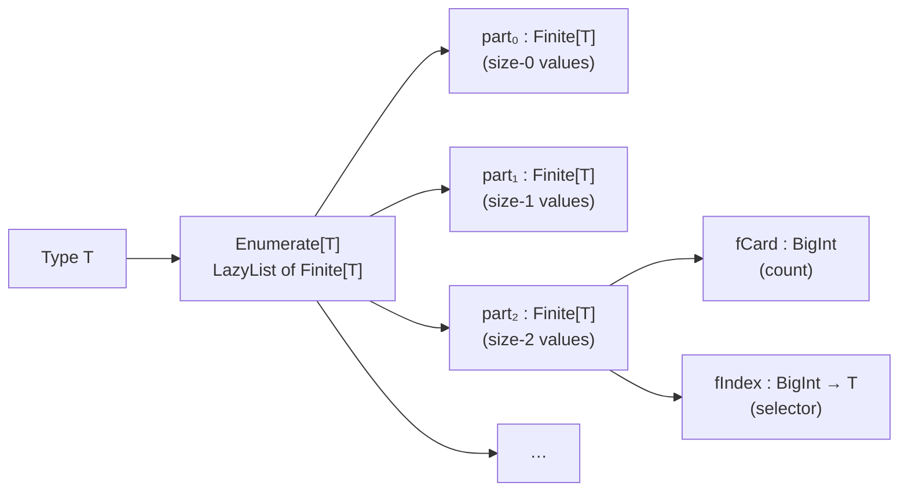
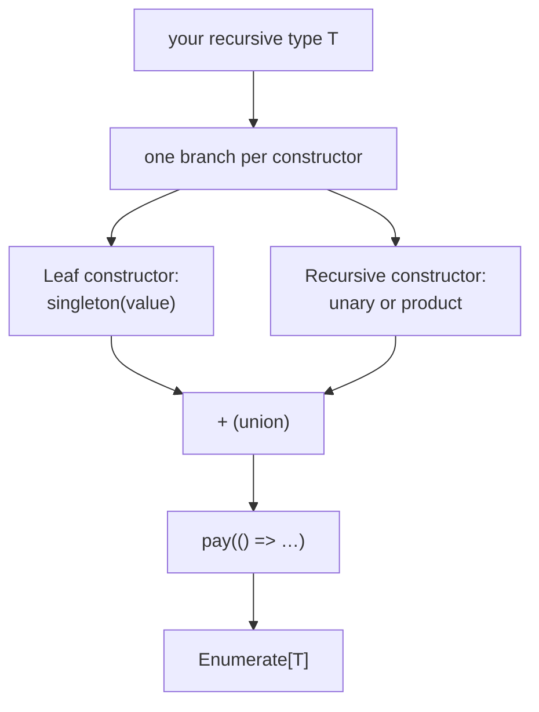

# Feat — Functional Enumeration of Algebraic Types

A MoonBit port of the ideas from _Feat: functional enumeration of algebraic
types_ (Duregård, Jansson, Wang, 2012). Feat turns an algebraic type into a
**bijection between the non-negative integers and its values**, so you can
enumerate, index, and sample finite parts of arbitrarily large types without
ever materializing the whole set.

> **Size notion.** In this README "size" means whatever the `Enumerable`
> instance chooses — usually one `pay` per constructor, but a user-defined
> instance can charge differently. The driver only relies on: each part
> is finite, parts are ordered by increasing size, and recursion is
> productive (guaranteed by `pay`).

> This package is a building block for MoonBit QuickCheck. It backs the
> "small check" mode (exhaustive testing for small sizes) and is independently
> useful whenever you want a deterministic, size-indexed view of a type.

## Why enumeration?

Random testing (QuickCheck) and exhaustive testing (SmallCheck) are two sides
of the same coin:

- **Random** is cheap, finds bugs lurking behind large inputs, but misses
  corner cases clustered near the "small" end of the space.
- **Exhaustive** catches every small-input bug but blows up combinatorially.

Feat's `Enumerate[T]` interleaves both: values are partitioned by a
user-chosen notion of **size**, so you can pick out the `i`-th value
overall or the `j`-th value at size `k` — deterministically, without
running the generator from the start.



## Install & Import

`feat` lives inside `moonbitlang/quickcheck`. Add the main package and then
import the sub-package in your `moon.pkg.json`:

```bash
moon add moonbitlang/quickcheck
```

```json
{
  "import": [
    { "path": "moonbitlang/quickcheck/feat", "alias": "feat" }
  ]
}
```

---

## The two core types

### `Finite[T]` — a random-access indexed chunk

A `Finite[T]` is a pair of a cardinality and an indexer. No values are stored;
`fIndex(i)` computes the `i`-th element on demand.

```moonbit nocheck
///|
pub(all) struct Finite[T] {
  fCard : BigInt
  fIndex : (BigInt) -> T
}
```

Most users do not construct `Finite`s via helper functions. Instead, they
usually get them out of `Enumerate::eval()` and inspect them with
`Finite::iter` / `Finite::to_array`. If you do need a custom chunk, you can
write one directly:

```mbt check
///|
test "hand-rolled finite chunk" {
  let f : @feat.Finite[String] = {
    fCard: 2,
    fIndex: i => {
      if i == 0 {
        "left"
      } else {
        guard i == 1 else { abort("index out of bounds") }
        "right"
      }
    },
  }
  inspect(
    f.to_array(),
    content=(
      #|(2, @list.from_array(["left", "right"]))
    ),
  )
}
```

`Finite`s are still composable once you have them. The most common case is
to combine parts produced by enumerations:

```mbt check
///|
test "disjoint union of two singleton parts" {
  let left = @feat.singleton("left").eval().head()
  let right = @feat.singleton("right").eval().head()
  let joined = left + right
  inspect(
    joined.to_array(),
    content=(
      #|(2, @list.from_array(["left", "right"]))
    ),
  )
}
```

Every `Finite[T]` is also iterable — `for x in finite { ... }` desugars
to `finite.iter()`, which walks `fIndex(0)..fIndex(fCard - 1)` lazily.
Use it whenever you want to stream a chunk's contents without
materialising the full list via `to_array`:

```mbt check
///|
test "for x in finite" {
  let acc : Array[BigInt] = []
  let finite : @feat.Finite[BigInt] = { fCard: 4, fIndex: i => i }
  for x in finite {
    acc.push(x)
  }
  assert_eq(acc, [0, 1, 2, 3])
}
```

### `Enumerate[T]` — a lazy list of `Finite[T]`

An `Enumerate[T]` is a **lazy stream of parts**, where the `k`-th part
contains all values of size `k`. Because the tail is lazy, infinite types
(`List`, `Tree`, recursive enums…) are perfectly legal.

```moonbit nocheck
///|
pub(all) struct Enumerate[T] {
  parts : LazyList[Finite[T]]
}
```

The `pay` combinator advances the size counter by one — it is the only way to
consume "fuel" and the reason a recursive enumeration doesn't diverge:

```mbt check
///|
test "singleton has size 0" {
  let e = @feat.singleton(42)
  let parts = e.eval()
  // The first (and only) part holds the single value.
  inspect(parts.head().to_array(), content="(1, @list.from_array([42]))")
}

///|
test "pay shifts everything one size up" {
  // Before pay: part₀ = {42}
  // After pay:  part₀ = {}, part₁ = {42}
  let shifted = @feat.pay(() => @feat.singleton(42))
  let parts = shifted.eval()
  inspect(parts.head().to_array(), content="(0, @list.from_array([]))")
  inspect(parts.tail().head().to_array(), content="(1, @list.from_array([42]))")
}
```

---

## The `Enumerable` trait — deriving enumerations

> **This is the main user-facing trait of the package.** Implement
> `Enumerable` for a type `T` and you get: indexed access
> (`enumerate()[i]`), size-bounded sampling via `feat_random`, and a
> ready-to-use `Gen[T]` for the top-level QuickCheck driver. Everything
> else in this package either consumes or produces an `Enumerable`.

### Signature

```moonbit nocheck
///|
pub(open) trait Enumerable {
  enumerate() -> Enumerate[Self]
}
```

- `pub(open)` — anyone can add an instance for their own type.
- The method is **nullary**: the enumeration of `T` depends only on `T`,
  not on any runtime state.
- Return type `Enumerate[Self]` is the lazy list-of-parts value
  documented above — see [`Enumerate[T]`](#enumeratet--a-lazy-list-of-finitet).

### The contract

An implementation must guarantee three properties so the driver can
use it safely:

| # | Property | What breaks if you violate it |
|---|----------|-------------------------------|
| 1 | **Cardinalities are non-negative.** Every part has `fCard : BigInt` and must satisfy `fCard >= 0`. Parts with `fCard == 0` are empty and collapse away. | The package assumes every part behaves like a finite set; a negative card produced by hand breaks that model and will lead to wrong indexing behaviour. |
| 2 | **Productivity under recursion.** Every recursive self-reference inside an `Enumerable` instance must be guarded by a `pay(...)`. An `Enumerate[T]` is a `LazyList` of parts, so it may be infinite — but each part must be reachable in finite time. | Evaluating `enumerate()` blows the stack or loops forever. |
| 3 | **Total indexing per part.** For every `i` with `0 <= i < part.fCard`, `part.fIndex(i)` must return a valid `T`. | Indexing aborts with "index out of bounds". |

These are the same invariants that the provided combinators already
preserve — so if you stick to `singleton`, `union` / `+`, `product`,
`unary`, `consts`, and `pay`, you get them for free.

### Built-in instances

| Type | Shape | Notes |
|------|-------|-------|
| `Unit` | `singleton(())` | Size 0, card 1. |
| `Bool` | `pay(true + false)` | Size 1, card 2 (inside `pay`). |
| `Byte` | flat `Finite` of card 256 | Size 0; indexes `0..255` directly. |
| `Char` | flat `Finite` of card 1,112,064 | Size 0; skips the UTF-16 surrogate range. |
| `Int` / `Int64` | interleaved `0, 1, -1, 2, -2, ...` | Size 0 through infinity; *infinite* parts each of card 1. |
| `UInt` / `UInt64` | `0, 1, 2, ...` with `pay` per step | Each successor costs one unit of size. |
| `Option[E]` where `E : Enumerable` | `pay(None + E::enumerate().fmap(Some))` | `None` at size 1, `Some(x)` at 1 + size(x). |
| `Result[T, E]` where `T, E : Enumerable` | `pay(Err + Ok)` | Both arms cost one `pay`. |
| `List[E]` where `E : Enumerable` | `pay(empty + Cons(e, lst))` | Each cons cell costs one `pay`. |
| `(A, B)` where `A, B : Enumerable` | `pay(product(A::enumerate(), B::enumerate()))` | Size = 1 + sum of component sizes. |

Key observation: **all non-primitive instances insert exactly one `pay`
per constructor boundary.** That's the rule you follow when writing
your own impl.

### Implementing `Enumerable` for your own type



Three rules, and that's it:

1. **One `+` summand per constructor.** Leaf constructors become
   `singleton(...)`; constructors that carry children use
   `unary(pair => Cons(pair.0, pair.1))` or `product(...)`.
2. **Wrap the whole thing in a `pay(...)`.** The `pay` is what gives the
   fixpoint a chance to suspend before recursing into `T::enumerate()`
   again — this is the productivity guarantee (contract item 2).
3. **Reach child enumerations through `Enumerable::enumerate()`, not by
   re-constructing them.** That way the compiler's inference picks up
   user-defined instances and built-ins uniformly.

A minimal recursive example (binary tree of `Leaf | Node`):

```mbt check
///|
enum Tree {
  Leaf
  Node(Tree, Tree)
}

///|
impl @feat.Enumerable for Tree with enumerate() {
  // One size unit per constructor; the recursive children are reached via
  // `unary`, which goes through the built-in `Enumerable` instance for
  // `(Tree, Tree)`. That instance itself inserts a `pay`, which is what keeps
  // the fixpoint productive.
  @feat.pay(() => {
    @feat.singleton(Leaf) +
    @feat.unary((pair : (Tree, Tree)) => Node(pair.0, pair.1))
  })
}

///|
impl Show for Tree with output(self, logger) {
  match self {
    Leaf => logger.write_string("Leaf")
    Node(l, r) => {
      logger.write_string("Node(")
      l.output(logger)
      logger.write_string(", ")
      r.output(logger)
      logger.write_string(")")
    }
  }
}

///|
test "enumerate the first few binary trees" {
  let trees : @feat.Enumerate[Tree] = Enumerable::enumerate()
  inspect(trees[0], content="Leaf")
  inspect(trees[1], content="Node(Leaf, Leaf)")
}
```

### Common pitfalls

| Pitfall | Why it hurts | Fix |
|---------|--------------|-----|
| Unguarded self-reference: `T::enumerate()` called without a surrounding `pay`. | Recursion diverges (contract #2). | Wrap the body in `@feat.pay(() => ...)`. Going through `unary` + the pair instance achieves the same because the built-in `(A, B)` instance inserts its own `pay`. |
| Computing a large Cartesian product with `product` before unioning. | Not wrong, just slow — the resulting parts get large and indexing locality suffers. | Prefer `unary` for a single-pair constructor, or `consts([...])` for a disjunction — these keep the structure flat. |
| Mixing eager `List` of `Enumerate` with `consts` at the top of a recursive definition. | The `List` itself is eager: its elements are forced when the `consts` is reached, which can run into the recursion before `pay` kicks in. | Ensure the `consts(...)` is inside `pay`, or use `+` between lazy `Enumerate`s. |
| Forgetting that zero-cardinality parts short-circuit. | Empty parts are skipped cheaply, but a hand-rolled `Finite` with a bogus non-zero `fCard` will still be indexed. | If you need an empty part, set `fCard: 0` and use an aborting `fIndex`. |

### Where the trait is consumed

- `unary(f)` requires the *input* type of `f` to be `Enumerable`.
- `Gen::feat_random(size)` takes `T : Enumerable` and turns it into a
  `Gen[T]` by drawing uniformly from parts `0..=size`.
- The main `moonbitlang/quickcheck` driver bridges `Enumerable` into
  small-check-style exhaustive testing via the same `feat_random`
  pipeline.

---

## Using an enumeration

### Indexing

`Enumerate::at(i)` (also written `e[i]`) is the "i-th value, overall" view.
Sizes are walked in order: all size-0 values, then all size-1 values, etc.

```mbt check
///|
test "index into Bool's enumeration" {
  // Enumerable::enumerate() for Bool yields [true, false] (inside pay).
  let e : @feat.Enumerate[Bool] = Enumerable::enumerate()
  inspect(e[0], content="true")
  inspect(e[1], content="false")
}

///|
test "index into a list enumeration" {
  let e : @feat.Enumerate[@list.List[Bool]] = Enumerable::enumerate()
  // Sizes grow as more cons cells are added.
  inspect(e[0], content="@list.from_array([])")
  inspect(e[1], content="@list.from_array([true])")
  inspect(e[2], content="@list.from_array([false])")
}
```

### Sampling the whole of size `k`

`eval()` exposes the underlying `LazyList[Finite[T]]`. Combined with
`Finite::to_array`, that lets you pull out *every* value at a specific size
— the SmallCheck-style "show me everything of size ≤ k" pattern.

```mbt check
///|
test "materialize every Bool at size 1" {
  let parts = (Enumerable::enumerate() : @feat.Enumerate[Bool]).eval()
  // part 0 is empty (Bool is defined with a pay).
  inspect(parts.head().to_array(), content="(0, @list.from_array([]))")
  // part 1 holds both booleans.
  inspect(
    parts.tail().head().to_array(),
    content="(2, @list.from_array([true, false]))",
  )
}
```

### Mapping and combining

`Enumerate[T]` is a functor together with a disjoint-union `+` and a
size-aware Cartesian `product`:

| Operation | Signature | Meaning |
|-----------|-----------|---------|
| `Enumerate::fmap(e, f)` | `Enumerate[T] -> (T -> U) -> Enumerate[U]` | Re-label every element |
| `e1 + e2` | `Enumerate[T] -> Enumerate[T] -> Enumerate[T]` | Interleave by size |
| `product(e1, e2)` | `Enumerate[A] -> Enumerate[B] -> Enumerate[(A, B)]` | Pair every A with every B, still size-indexed |
| `pay(() => …)` | `(() -> Enumerate[T]) -> Enumerate[T]` | Charge 1 unit of size |
| `unary(f)` | `(T -> U) -> Enumerate[U]` where `T : Enumerable` | Shortcut for `T::enumerate().fmap(f)` |

```mbt check
///|
test "fmap rewrites every element in place" {
  let bools : @feat.Enumerate[Bool] = Enumerable::enumerate()
  let labels = bools.fmap(b => if b { "yes" } else { "no" })
  assert_eq(labels[0], "yes")
  assert_eq(labels[1], "no")
}

///|
test "product generates every pair in part order" {
  let pairs = @feat.product(zero_or_one_part(), zero_or_one_part())
  inspect(pairs[0], content="(0, 0)")
  inspect(pairs[1], content="(0, 1)")
  inspect(pairs[2], content="(1, 0)")
  inspect(pairs[3], content="(1, 1)")
}

///|
fn zero_or_one_part() -> @feat.Enumerate[BigInt] {
  { parts: Cons({ fCard: 2, fIndex: i => i }, @lazy.LazyRef::from_value(Nil)) }
}
```


---

## When to reach for Feat vs. random QuickCheck

| Situation | Prefer |
|-----------|--------|
| "Try every value up to size 10." | Feat (indexing in a loop) |
| "Find a counterexample in a space I can't enumerate in reasonable time." | QuickCheck (random `Arbitrary`) |
| "Deterministic, reproducible fuzz corpus across runs." | Feat (size-indexed, no RNG) |
| "I need shrinking to a small counterexample." | QuickCheck + `Shrink` or `falsify` |

For large-scale property tests, Feat is also used to seed an initial corpus,
which is then handed to the random driver.

## API Reference (quick scan)

### Values

| Name | What it does |
|------|-------------|
| `empty()` | `Enumerate[T]` with no elements |
| `singleton(x)` | One-element enumeration at size 0 |
| `pay(thunk)` | Shift every part one size up |
| `a + b` | Interleaved disjoint union of two enumerations |
| `product(a, b)` | Pair-up enumeration; size is the **sum** of component sizes |
| `consts(list)` | `pay`-wrapped union of a `List` of enumerations |
| `unary(f)` | `T::enumerate().fmap(f)` for `T : Enumerable` |
| `Finite::iter`, `Finite::to_array` | Inspect a `Finite[T]` part once you have one |

### Types

| Type | Purpose |
|------|---------|
| `Finite[T]` | Cardinality + indexer (`BigInt -> T`); usually obtained from `eval()` |
| `Enumerate[T]` | `LazyList[Finite[T]]`; one element per size |
| `Enumerable` trait | `enumerate() -> Enumerate[Self]` |

## Further reading

- Jonas Duregård, Patrik Jansson, Meng Wang.
  [_Feat: functional enumeration of algebraic types_](https://doi.org/10.1145/2430532.2364515).
  Haskell Symposium, 2012.
- The MoonBit QuickCheck paper / README for the integration with random
  generation and shrinking.

## License

Apache-2.0.
