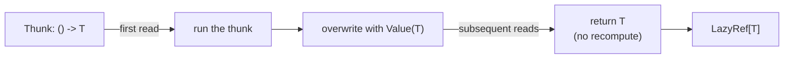
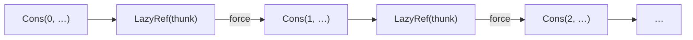

# Lazy — Lazy Lists & Memoized Thunks

> **Internal package** — lives at `moonbitlang/quickcheck/internal/lazy`
> and is not importable from outside this module (MoonBit enforces
> Go-style `internal/` visibility at the module boundary). If you need
> a lazy list in a downstream project, vendor a copy — the whole
> package is ~300 lines.

A small library for **call-by-need** values and **streams**. Used as
the backbone of the `feat` enumeration library (sizes of a type are an
infinite lazy list), the `falsify` sample-tree tails, and the
`internal/shrinking` tree-formatter.

## What this gives you



1. **`LazyRef[T]`** — a memoized thunk. The first call to `force` evaluates;
   every call after that returns the cached value without recomputing.
2. **`LazyList[T]`** — a cons-list whose *tail* is a `LazyRef`, so infinite
   streams (`[0, 1, 2, …]`) are just values.

---

## `LazyRef[T]` — thunk with memoization

```moonbit nocheck
type LazyRef[T]
pub fn[T] LazyRef::from_value(T) -> Self[T]
pub fn[T] LazyRef::from_thunk(() -> T) -> Self[T]
pub fn[T] LazyRef::force(Self[T]) -> T
```

A `LazyRef` is either `Value(x)` (already evaluated) or `Thunk(f)` (compute on
first touch). `force` promotes a `Thunk` to a `Value` in place, so repeated
access is O(1).

```mbt check
///|
test "LazyRef::from_thunk runs the thunk exactly once" {
  let calls = Ref::new(0)
  let lazy_ref = @lazy.LazyRef::from_thunk(() => {
    calls.val += 1
    42
  })
  // Nothing has run yet.
  assert_eq(calls.val, 0)
  // First force: runs the thunk, caches the result.
  assert_eq(lazy_ref.force(), 42)
  assert_eq(calls.val, 1)
  // Second force: returns the cached value.
  assert_eq(lazy_ref.force(), 42)
  assert_eq(calls.val, 1)
}

///|
test "LazyRef::from_value skips computation" {
  let r = @lazy.LazyRef::from_value("hello")
  assert_eq(r.force(), "hello")
}
```

---

## `LazyList[T]` — infinite lists, finitely

```moonbit nocheck
///|
pub(all) enum LazyList[T] {
  Nil
  Cons(T, LazyRef[LazyList[T]])
}
```

The tail is a `LazyRef`, which is what makes `repeat`, `infinite_stream`, and
co-inductive definitions safe. You consume a `LazyList` by taking a finite
prefix and then forcing it.

### Finite lists

Convert from a regular `@list.List` and back as needed:

```mbt check
///|
test "from_list / back via take" {
  let xs = @lazy.from_list(@list.from_array([1, 2, 3]))
  inspect(xs, content="[1, 2, 3]")
  assert_eq(xs.head(), 1)
  assert_eq(xs.length(), 3)
}
```

### Infinite streams

`repeat(x)` is an infinite stream of `x`. `infinite_stream(start, step)` is
an arithmetic progression. They produce data *as you ask for it*, so there's
no loop.

```mbt check
///|
test "repeat and infinite_stream are bounded by take" {
  inspect(@lazy.repeat(7).take(4), content="[7, 7, 7, 7]")
  inspect(@lazy.infinite_stream(0, 1).take(6), content="[0, 1, 2, 3, 4, 5]")
  inspect(@lazy.infinite_stream(1, 2).take(5), content="[1, 3, 5, 7, 9]")
}
```



### Transformations

`map`, `concat` (`+`), `take`, `drop`, `take_while`, `drop_while`,
`split_at`, and `unfold` all preserve laziness — they only force as many
cells of the input as you ask about.

```mbt check
///|
test "map and take compose lazily" {
  let squares = @lazy.infinite_stream(1, 1).map(x => x * x)
  inspect(squares.take(5), content="[1, 4, 9, 16, 25]")
}

///|
test "take_while stops at the first failure" {
  inspect(
    @lazy.infinite_stream(1, 1).take_while(x => x < 5),
    content="[1, 2, 3, 4]",
  )
}

///|
test "concat (+) appends two streams" {
  let xs = @lazy.from_list(@list.from_array([1, 2, 3]))
  let ys = @lazy.from_list(@list.from_array([4, 5, 6]))
  inspect(xs + ys, content="[1, 2, 3, 4, 5, 6]")
}

///|
test "split_at is (take n, drop n) fused" {
  let xs = @lazy.infinite_stream(0, 1).take(6)
  let (left, right) = xs.split_at(3)
  inspect(left, content="[0, 1, 2]")
  inspect(right, content="[3, 4, 5]")
}

///|
test "drop_while skips the failing prefix, keeps the rest" {
  let xs = @lazy.from_list(@list.from_array([1, 2, 3, 10, 4, 5]))
  inspect(xs.drop_while(x => x < 5), content="[10, 4, 5]")
}

///|
test "tails exposes every suffix" {
  let xs = @lazy.from_list(@list.from_array([1, 2, 3]))
  inspect(xs.tails(), content="[[1, 2, 3], [2, 3], [3], []]")
}
```

### Folding

Standard left/right folds. Right-fold is defined naively so it should be
driven by a lazy accumulator for infinite inputs.

```mbt check
///|
test "fold_left sums a finite prefix" {
  let xs = @lazy.infinite_stream(1, 1).take(10)
  assert_eq(xs.fold_left((acc, x) => acc + x, init=0), 55)
}

///|
test "sum is fold_left with Add::add" {
  let xs = @lazy.from_list(@list.from_array([1, 2, 3, 4]))
  assert_eq(@lazy.sum(xs, init=0), 10)
}
```

### Zipping

`zip_with` is the standard element-wise pair-up. `zip_plus` is an
element-wise fold that **keeps the longer tail** (it doesn't truncate at
the shorter input). That's exactly the shape needed to fuse the size-indexed
parts of two `Enumerate`s in `feat`.

```mbt check
///|
test "zip_with truncates at the shorter list" {
  let a = @lazy.infinite_stream(1, 1)
  let b = @lazy.from_list(@list.from_array([10, 20, 30]))
  inspect(@lazy.zip_with((x, y) => x + y, a, b), content="[11, 22, 33]")
}

///|
test "zip_plus keeps the longer tail" {
  let a = @lazy.from_list(@list.from_array([1, 2]))
  let b = @lazy.from_list(@list.from_array([10, 20, 30, 40]))
  inspect(@lazy.zip_plus((x, y) => x + y, a, b), content="[11, 22, 30, 40]")
}
```

### Unfolding

`unfold` is the co-inductive dual of `fold_left`. Given a seed and a
`step : state -> Option[(T, state)]`, it lazily produces elements.

```mbt check
///|
test "unfold builds a countdown" {
  let seed = @lazy.from_list(@list.from_array([5]))
  let countdown = seed.unfold(cur => {
    match cur {
      Cons(n, _) =>
        if n == 0 {
          None
        } else {
          let next = @lazy.from_list(@list.from_array([n - 1]))
          Some((n, next))
        }
      Nil => None
    }
  })
  inspect(countdown, content="[5, 4, 3, 2, 1]")
}
```

---

## API Reference

### `LazyRef[T]`

| Operation | Type | Notes |
|-----------|------|-------|
| `LazyRef::from_value(x)` | `T -> LazyRef[T]` | Already-evaluated thunk |
| `LazyRef::from_thunk(f)` | `(() -> T) -> LazyRef[T]` | Delayed, memoizes on first `force` |
| `force(self)` | `LazyRef[T] -> T` | Idempotent; mutates in place to cache |

### `LazyList[T]`

| Operation | Type | Notes |
|-----------|------|-------|
| `from_list(ls)` | `@list.List[T] -> LazyList[T]` | Promote an eager list |
| `default()` | `() -> LazyList[T]` | Alias for `Nil` |
| `repeat(x)` | `T -> LazyList[T]` | Infinite `[x, x, x, …]` |
| `infinite_stream(start, step)` | `T -> T -> LazyList[T]` | Arithmetic progression (`T : Add`) |
| `head` / `tail` | `LazyList[T] -> T` / `LazyList[T]` | Panics on `Nil` |
| `length` | `LazyList[T] -> Int` | Forces the entire list |
| `index` | `LazyList[T] -> Int -> T` | O(n) |
| `take` / `drop` / `split_at` | count-indexed slicing | Preserves laziness |
| `take_while` / `drop_while` | predicate-indexed slicing | Stops at first failure |
| `map` | `(T -> U) -> LazyList[T] -> LazyList[U]` | Lazy |
| `concat` / `+` | `LazyList[T] -> LazyList[T] -> LazyList[T]` | Lazy append |
| `fold_left` / `fold_right` | standard folds | `fold_right` is eager; use carefully on infinite input |
| `zip_with` / `zip_plus` | element-wise combine | `zip_plus` keeps longer tail |
| `zip_lazy_normal` | mixed lazy/eager zip | Used by `feat` internally |
| `unfold` | co-inductive generator | Dual of `fold_left` |
| `tails` | `LazyList[T] -> LazyList[LazyList[T]]` | All suffixes, including `Nil` |
| `sum` | `(LazyList[X], init~ : X) -> X` (where `X : Add`) | Fold over `+`, requires explicit `init` |

## Traits

This package **exposes no traits of its own.** `LazyRef[T]` and
`LazyList[T]` are deliberately concrete types — every consumer works
against the `Cons` / `Nil` shape directly.

Downstream, values built here feed into the trait-driven layers of
`moonbitlang/quickcheck`:

- `@feat.Enumerate[T]` stores its parts as a `LazyList[Finite[T]]`, so
  every `@feat.Enumerable` instance implicitly relies on `LazyList` to
  stay productive.
- `@falsify.Gen[T]` threads `LazyRef` through its `SampleTree` to delay
  the infinite random prefix (see `@falsify`'s README for the
  caveats — eager construction of `SampleTree` is a known rough edge).
- The root `moonbitlang/quickcheck.Shrink` trait returns `Iter[Self]`
  rather than a `LazyList`, so end users rarely touch this type
  directly.

If your property-test setup deals with `Testable` or `Shrink`, you're
one layer up from this package. See the root `moonbitlang/quickcheck`
README for those traits.

## Safety notes

- `head`, `tail`, `index` **panic** on an out-of-range or empty input —
  match on `Nil`/`Cons` if you can't rule that out.
- `length`, `fold_left`, and `Show::output` all force the entire list. Don't
  call them on an infinite `LazyList`.
- `LazyRef` mutates its body on first `force`. It's safe in single-threaded
  MoonBit code, which is the only execution model this library targets.

## License

Apache-2.0.
