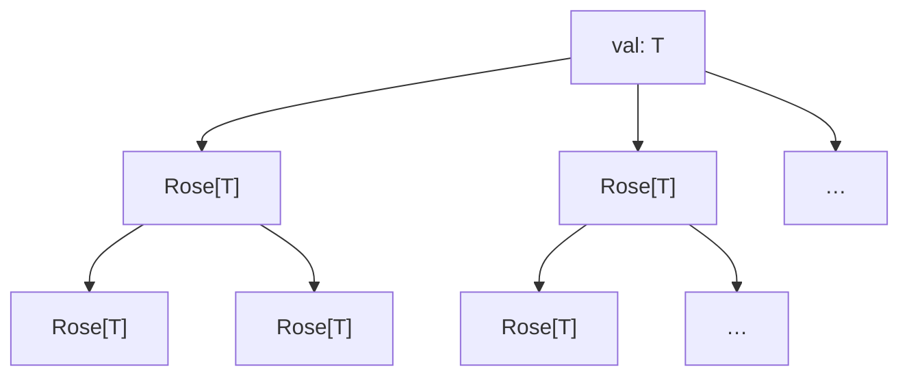
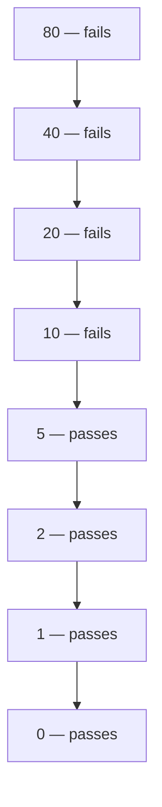
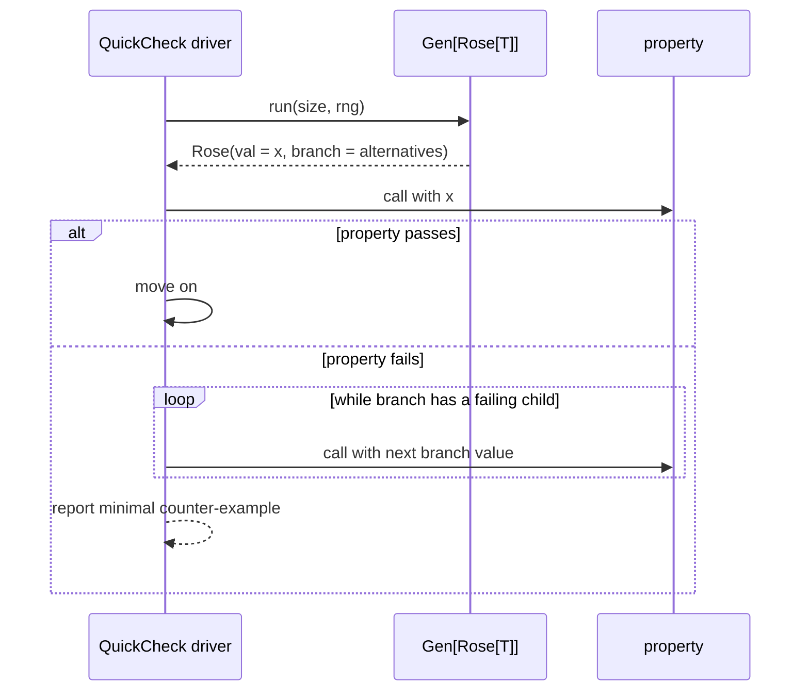

# Rose — Rose Trees for Integrated Shrinking

> **Internal package** — lives at `moonbitlang/quickcheck/internal/rose`
> and is not importable from outside this module.

A tiny package: one data type plus the functor/monad toolkit (`pure`, `new`,
`fmap`, `bind`, `join`, `apply`). A **rose tree** is a node holding a value
together with a (possibly infinite) lazy iterator of children rose trees.
That's the data structure John Hughes used in the original QuickCheck to tie
*generation* and *shrinking* together — hence "integrated shrinking".

## The shape

```moonbit nocheck
///|
pub(all) struct Rose[T] {
  val : T
  branch : Iter[Rose[T]]
}
```



Every node carries *a candidate value* and *the strictly simpler variants we
could retreat to if this one falsifies a property*. When a QuickCheck property
fails on `rose.val`, the shrinker walks `rose.branch` looking for another
`val` that still fails — and repeats, following the child whose children are
even simpler. Because `branch` is `Iter`, sub-trees are generated on demand;
unexplored alternatives never allocate.

## Why a tree, and not just `Iter[T]`?

`Rose[T]` and `Iter[T]` *look* similar — both are lazy and yield `T`s — but
they have a different **shape**, and that shape is exactly what integrated
shrinking needs.

| | Layout | What you can do at "the next step" |
|---|---|---|
| `Iter[T]` | flat stream `[t₀, t₁, t₂, …]` | Pull the next sibling. |
| `Rose[T]` | tree; every node carries `T` plus an `Iter[Rose[T]]` of children | Pull the next sibling **or descend into a node's own children.** |

When you've pulled `t₁` from an `Iter[T]`, the iterator only knows what
comes *after* `t₁` in the same flat stream. When you've descended into a
`Rose(t₁, branch)` node, you *also* know what's "smaller than `t₁`" — it's
exactly that node's `branch`. That "go *into* a node, not just past it"
move is the one shrinking depends on.

### A worked example

Suppose the shrink space for an integer is "halve towards 0", and the
property under test is `x < 10`. Starting at 80, the shrink tree looks like
this (each node's `val` is shown; `fails` / `passes` is the property's
verdict on that value):



A `Rose`-shaped driver does a depth-first search:

1. 80 fails → look in *80's* `branch`.
2. 40 fails → look in *40's* `branch`.
3. 20 fails → look in *20's* `branch`.
4. 10 fails → look in *10's* `branch`.
5. 5 passes → back up. No more failing candidates. Report **10** as the
   minimal counter-example.

The interesting step is **2**: at that moment the driver needs "what's
smaller than 40?". The tree already carries that — it's `Rose(40, …)`'s
own `branch`. With a flat `Iter[Int]` returned by some `shrink(80)`, you'd
be stuck: the iter knows `[40, 20, 10, 5, 0]` but it does not know "what's
smaller than 40 *specifically*". The only fix is to re-call `shrink(40)`,
then `shrink(20)`, … from scratch at each level — which is exactly the
classical `Shrink` design, and the reason it has to be hand-written for
every type and combinator.

We can verify the descent path is recoverable from the tree alone, no
re-shrinking required:

```mbt check
///|
test "halving shrinker descends step-by-step" {
  fn halve(x : Int) -> @rose.Rose[Int] {
    if x == 0 {
      @rose.pure(0)
    } else {
      Rose(x, Iter::singleton(halve(x / 2)))
    }
  }

  let r0 = halve(80)
  // Walk the single child branch four levels deep.
  let r1 = r0.branch.head().unwrap()
  let r2 = r1.branch.head().unwrap()
  let r3 = r2.branch.head().unwrap()
  let r4 = r3.branch.head().unwrap()
  @debug.assert_eq([r0.val, r1.val, r2.val, r3.val, r4.val], [80, 40, 20, 10, 5])
}
```

The compositional payoff:

- **No hand-written shrinker per type.** Because `Rose` is a monad
  (see below), composing generators *automatically* composes shrinkers.
  `Gen[(A, B)]` derives shrinking from `Gen[A]` and `Gen[B]` for free —
  no bespoke `Shrink` instance for the pair.
- **No re-running the shrinker on each candidate.** The shrink space is
  laid out lazily up front; the driver consumes only the path it takes.
- **Shrink-space is data, not code.** It's `debug_inspect`-able, testable
  in isolation, and reasonable about without a property in scope.

The flat `Iter[T]` API survives elsewhere in this codebase — the root
package's `Shrink` trait is the classical "give me a bag of simpler
candidates" interface — but `Rose` is what the driver actually walks.


## Building rose trees

`pure(x)` is a leaf: the value `x` with no alternatives. `new(val, branch)`
lets you attach any `Iter[Rose[T]]` of shrinks.

```mbt check
///|
test "pure is a leaf with no alternatives" {
  let leaf = @rose.pure(42)
  assert_eq(leaf.val, 42)
  assert_eq(leaf.branch.count(), 0)
}

///|
test "new attaches explicit shrinks" {
  let rose = @rose.Rose(3, [@rose.pure(0), @rose.pure(1), @rose.pure(2)])
  assert_eq(rose.val, 3)
  let children = rose.branch.collect()
  assert_eq(children.length(), 3)
  assert_eq(children[0].val, 0)
  assert_eq(children[2].val, 2)
}
```

### Concrete example: integer shrinker

A standard QuickCheck "shrink towards 0" tree. Each node offers one
alternative — its half — and the tree walks all the way down to 0.

```mbt check
///|
fn shrink_int(n : Int) -> @rose.Rose[Int] {
  fn go(x : Int) -> @rose.Rose[Int] {
    if x == 0 {
      @rose.pure(0)
    } else {
      Rose(x, Iter::singleton(go(x / 2)))
    }
  }

  go(n)
}

///|
test "int shrinker halves towards 0" {
  let r = shrink_int(8)
  assert_eq(r.val, 8)
  // The single branch points to 4.
  let c1 = r.branch.head().unwrap()
  assert_eq(c1.val, 4)
  // …then 2.
  let c2 = c1.branch.head().unwrap()
  assert_eq(c2.val, 2)
  // …then 1, then 0 (a leaf).
  let c3 = c2.branch.head().unwrap()
  assert_eq(c3.val, 1)
  let c4 = c3.branch.head().unwrap()
  assert_eq(c4.val, 0)
  assert_eq(c4.branch.count(), 0)
}
```

---

## The implicit invariants

`Rose[T]` is *just* `{val: T, branch: Iter[Rose[T]]}` — the type imposes
no constraint between a node and its children. `T` doesn't even need to
be `Compare`. But every well-behaved shrinker (and the search loop in
`find_min_failing` and the real driver) **relies on three implicit
invariants** holding by construction:

1. **Children are strictly "simpler" than the parent.** "Simpler" is
   type-defined: smaller magnitude for `Int`, shorter for `Array[T]`,
   structurally smaller for recursive types. Violate this and the
   minimal counter-example reported won't actually be minimal.
2. **The descent is well-founded.** Every path from the root eventually
   reaches a leaf (an empty `branch`). For `Int`, the chain
   `n → n/2 → … → 0` always terminates; for `Array`, you can't keep
   dropping elements forever. Violate this and the search diverges.
3. **`branch` is lazy.** `Iter` is single-shot and on-demand, so
   infinite *width* (an unbounded stream of siblings, e.g.
   `Iter::repeat(pure(7))`) is fine — the driver only forces the
   children it actually descends into.

Pathological example — *don't construct trees like this*:

```moonbit nocheck
// Children are LARGER than the parent. The driver, asked "is there
// something smaller that still fails?", happily descends into 100,
// then 100's "shrinks" (which would be even larger), and never stops.
@rose.Rose(1, [@rose.pure(100), @rose.pure(200)])
```

The invariants aren't checked by the type system. You uphold them
inductively, by composing well-behaved primitives:

| Primitive | How the invariants are preserved |
|-----------|----------------------------------|
| `pure(x)` | Leaf — trivially well-founded. |
| `Int` halving shrinker (e.g. `shrink_int` above) | `x / 2` strictly decreases in magnitude; bottom is `0`. |
| `Array::shrink` (drop one element) | Each child is strictly shorter; bottom is `[]`. |
| `Rose::fmap(r, f)` | Carries `r`'s invariants, assuming `f` doesn't reorder magnitudes. |
| `Rose::bind(r, f)` | Carries them over if every `f(x)` is itself well-founded. |

If you wanted *type-level* enforcement you'd need a `Shrink` bound on
`T` plus a smart constructor that re-checks each candidate — which
costs you flexibility (no `Rose[(A) -> B]`, no `Rose` of opaque values)
for a property the integrated-shrinking pipeline already maintains by
construction.

---

## Rose is a monad

That's the integrated-shrinking trick: because `Rose` is a monad, every
generator written in a `Gen[Rose[T]]` style automatically produces not just
*a value* but *a tree of values and their shrinks*. No separate `Shrink`
instance needed.

| Operation | Signature | Meaning |
|-----------|-----------|---------|
| `pure(x)` | `T -> Rose[T]` | Leaf |
| `Rose::fmap(r, f)` | `Rose[T] -> (T -> U) -> Rose[U]` | Rename every node |
| `Rose::bind(r, f)` | `Rose[T] -> (T -> Rose[U]) -> Rose[U]` | Dependent substitution |
| `Rose::join(r)` | `Rose[Rose[T]] -> Rose[T]` | Flatten two levels |
| `Rose::apply(r, f)` | `Rose[T] -> ((T, Iter[Rose[T]]) -> Rose[T]) -> Rose[T]` | Inspect node + its branch |
| `Rose::iter(r)` | `Rose[T] -> Iter[T]` | Lazy depth-first walk; enables `for x in r { ... }` |

### `fmap`

Maps `f` over every node in the tree. Structure is preserved.

```mbt check
///|
test "fmap relabels every node" {
  let r = @rose.Rose(2, [@rose.pure(0), @rose.pure(1)])
  let doubled = r.fmap(x => x * 10)
  assert_eq(doubled.val, 20)
  let children : Array[Int] = doubled.branch.map(c => c.val).collect()
  @debug.assert_eq(children, [0, 10])
}
```

### `bind` / `join`

`bind` substitutes a tree at **every node** of the input; `join` is `bind`
with the identity — both collapse `Rose[Rose[T]]` into `Rose[T]`. The rule:
keep the outer root's own branches and *append* the inner tree's branches
after the new sub-trees.

```mbt check
///|
test "bind substitutes at every node" {
  let r = @rose.Rose(1, [@rose.pure(0)])
  // For every node n, emit a Rose that also has "n - 1" as an alternative.
  let expanded = r.bind(n => {
    Rose(
      n,
      if n == 0 {
        Iter::empty()
      } else {
        Iter::singleton(@rose.pure(n - 1))
      },
    )
  })
  assert_eq(expanded.val, 1)
  // bind preserves the value; the tree gains new alternatives from f.
  let kids : Array[Int] = expanded.branch.map(c => c.val).collect()
  // First come the branches produced by `f(1)`: one alternative, 0.
  // Then come the original branches' fmapped forms: the leaf 0.
  @debug.assert_eq(kids, [0, 0])
}

///|
test "join flattens Rose[Rose[T]] into Rose[T]" {
  // Outer tree of Roses; the root already carries a Rose[Int].
  let inner = @rose.Rose(10, [@rose.pure(5)])
  let outer : @rose.Rose[@rose.Rose[Int]] = Rose(inner, [@rose.pure(@rose.pure(7))])
  let flat = outer.join()
  // The root value is the root of the inner Rose.
  assert_eq(flat.val, 10)
  // The joined branches are: (flattened outer siblings) ++ (inner's own
  // branches).
  let kids : Array[Int] = flat.branch.map(c => c.val).collect()
  @debug.assert_eq(kids, [7, 5])
}
```

### `apply`

A node-level escape hatch: inspect both the current value *and* its branches
and produce a replacement rose. Handy when you want to annotate, filter, or
decorate a generated tree.

```mbt check
///|
test "apply rewrites a single node" {
  let r = @rose.Rose(10, [@rose.pure(5), @rose.pure(0)])
  // Collapse the tree: drop all branches, keep only the root.
  let collapsed = r.apply((v, _) => @rose.pure(v))
  assert_eq(collapsed.val, 10)
  assert_eq(collapsed.branch.count(), 0)
}
```

### `iter` — depth-first walk and `for x in rose { ... }`

`Rose::iter` produces a lazy `Iter[T]` over every value in the tree, root
first, then each branch depth-first. Because MoonBit's `for x in <expr>`
loop calls `<expr>.iter()`, you can use `Rose` directly with the loop sugar.

```mbt check
///|
test "iter visits root then branches in DFS order" {
  let tree = @rose.Rose(
    1,
    [Rose(2, [@rose.pure(3), @rose.pure(4)]), Rose(5, [@rose.pure(6)])],
  )
  @debug.assert_eq(tree.iter().collect(), [1, 2, 3, 4, 5, 6])
}

///|
test "for .. in walks every value" {
  let tree = @rose.Rose(10, [@rose.pure(20), @rose.pure(30)])

  @debug.assert_eq([ for x in tree => x ], [10, 20, 30])
}
```

The traversal is lazy: only as many sub-trees as you actually consume
get forced. Like every `Iter` in MoonBit it is single-shot, so a second
walk over the same `Rose` will only see whatever branches were not yet
consumed by an earlier walk.

---

## How it plugs into QuickCheck



`Rose` itself doesn't talk to the driver — it's just the "shape of a
shrinkable value" data type. The actual driver lives in
`moonbitlang/quickcheck/falsify` (for internal shrinking) and in the main
`moonbitlang/quickcheck` package (for the classical external shrinker).

## When to use it directly

Most users never touch `Rose` — they derive `Shrink` or let the `falsify`
driver construct the tree for them. You'd reach for `Rose` directly when:

- Writing a custom `Gen[T]` with bespoke shrinking semantics.
- Testing your shrinker itself, where the tree shape matters.
- Porting Haskell/OCaml code that uses integrated shrinking.

## Traits

This package **exposes no traits of its own** — `Rose[T]` is a plain
struct, and all its operations are ordinary methods.

`Rose` is the *value* that a trait-aware shrinker works with, not the
trait itself:

- The root package's `Shrink` trait (`shrink(Self) -> Iter[Self]`) is the
  classical, external counterpart. A `Shrink` impl emits a flat
  `Iter[Self]`; `Rose` organizes those candidates as a tree so the
  driver can follow a failing branch without re-running the generator
  from scratch.
- The `moonbitlang/quickcheck/falsify` engine goes the other direction:
  a `@falsify.Gen[T]` produces `(T, Iter[SampleTree])`, which the
  driver re-interprets *as* a rose tree during shrink-search.
- `Rose[T]` derives `@debug.Debug`, so `debug_inspect(tree, content=...)`
  gives you a readable snapshot for tests.

If you see `Testable`, `Shrink`, or `Arbitrary` in a signature, you're
one layer up from this package.

## References

- Koen Claessen, John Hughes. _QuickCheck: a lightweight tool for random
  testing of Haskell programs._ ICFP 2000.
- Edsko de Vries. _falsify: Internal Shrinking Reimagined for Haskell._
  Haskell Symposium 2023. — The conceptual basis for the integrated-shrinking
  driver sitting on top of this module.

## License

Apache-2.0.
