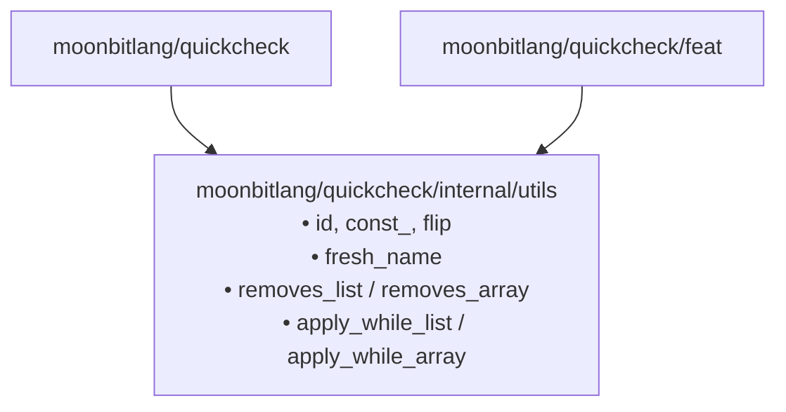

# Utils — Small helpers shared across QuickCheck

> **Internal package** — lives at `moonbitlang/quickcheck/internal/utils`
> and is not importable from outside this module (MoonBit enforces
> Go-style `internal/` visibility at the module boundary).

A grab-bag of tiny, dependency-free helpers used by the rest of the
`moonbitlang/quickcheck` family. None of this is intellectually deep:
these are the utilities that kept showing up in more than one place
and were worth factoring out.

## Why this package exists



Keeping these helpers in a single `internal` package means every
QuickCheck module can `import` them without polluting the published
surface area of the main library.

---

## Combinators

| Name | Signature | Meaning |
|------|-----------|---------|
| `const_(t)(_)` | `T -> U -> T` | Ignore the second argument, return the first |
| `flip(f)(x, y)` | `((A, B) -> C) -> (B, A) -> C` | Swap argument order |

> `id` and `pair_function` are **deprecated** — inline `x => x` and
> `tuple => f(tuple.0, tuple.1)` at the call site instead.

```mbt check
///|
test "const_ ignores the second argument" {
  let always_7 : (String) -> Int = @utils.const_(7)
  assert_eq(always_7("whatever"), 7)
  assert_eq(always_7("anything"), 7)
}

///|
test "flip swaps argument order" {
  let sub = (x : Int, y : Int) => x - y
  let rsub = @utils.flip(sub)
  assert_eq(sub(10, 3), 7)
  assert_eq(rsub(10, 3), -7)
}
```

---

## `fresh_name` — monotonic unique string

`fresh_name()` returns a new `"test-0"`, `"test-1"`, `"test-2"`, … on each
call. It's a convenience for tests where you just need *some* unique label
and don't care what it is. Backed by a single global counter.

```mbt check
///|
test "fresh_name produces monotonically distinct names" {
  let a = @utils.fresh_name()
  let b = @utils.fresh_name()
  let c = @utils.fresh_name()
  assert_true(a != b)
  assert_true(b != c)
  assert_true(a != c)
}
```

> The counter is **process-global**. Tests may observe names from earlier
> calls in the same run; don't assert on the numeric suffix.

---

## `removes_list` / `removes_array` — chunk-wise removal for halving shrinkers

A shrinking primitive tailored to the classical QuickCheck list shrinker:
*"Walk `xs` in chunks of `k`. For each chunk boundary, produce the variant
that drops everything up to that boundary's chunk, re-using the already-seen
prefix."* Equivalently, you get **one variant per non-empty tail chunk**,
each formed by concatenating the prefix seen so far with the suffix after
the dropped chunk.

```moonbit nocheck
pub fn[T] removes_list(k : Int, n : Int, xs : List[T]) -> List[List[T]]
pub fn[T] removes_array(k : Int, n : Int, xs : Array[T]) -> Array[Array[T]]
```

- `k` — chunk size to drop at each step
- `n` — total length budget (typically `xs.length()`)
- `xs` — the input

```mbt check
///|
test "removes_array walks in chunks of k" {
  // Input  : [1, 2, 3, 4, 5, 6], k = 2
  // Chunks : (1 2) (3 4) (5 6)
  // Variants: drop (1 2) -> [3, 4, 5, 6]
  //           drop (3 4) -> [1, 2, 5, 6]
  //           the final chunk (5 6) is not a variant — there's nothing left
  //           after it, so there's no tail to keep.
  let xs = [1, 2, 3, 4, 5, 6]
  let variants = @utils.removes_array(2, xs.length(), xs)
  assert_eq(variants.length(), 2)
  assert_eq(variants[0], [3, 4, 5, 6])
  assert_eq(variants[1], [1, 2, 5, 6])
}

///|
test "removes_list matches the chunk-wise semantics" {
  // Input  : [1, 2, 3, 4], k = 2 — only the first chunk has a non-empty tail.
  let xs = @list.from_array([1, 2, 3, 4])
  let variants = @utils.removes_list(2, 4, xs)
  inspect(
    variants,
    content=(
      #|@list.from_array([@list.from_array([3, 4])])
    ),
  )
}
```

---

## `apply_while_list` / `apply_while_array` — iterate while a guard holds

Repeatedly apply a function starting from a seed, accumulating every value
for which the guard still holds.

```moonbit nocheck
pub fn[T] apply_while_array(T, (T) -> T, (T) -> Bool) -> Array[T]
pub fn[T] apply_while_list (T, (T) -> T, (T) -> Bool) -> List[T]
```

> **Order matters.** Results are accumulated by prepending (array `[..]`
> / list `add`), so the returned collection is in **reverse iteration
> order** — newest first, oldest last.

```mbt check
///|
test "apply_while_array accumulates in reverse order" {
  // Seed is 16, f = x/2, guard = x > 0.
  // The *next* values visited are 8, 4, 2, 1, then 0 fails the guard.
  // apply_while_array prepends each, so the output starts with the last
  // kept value (1) and ends with the first (8).
  let halvings = @utils.apply_while_array(16, x => x / 2, x => x > 0)
  assert_eq(halvings, [1, 2, 4, 8])
}
```

---

## API summary

### Combinators

| Name | Type |
|------|------|
| `id` | `T -> T` |
| `const_` | `T -> (U -> T)` |
| `flip` | `((A, B) -> C) -> (B, A) -> C` |
| `pair_function` _(deprecated)_ | `((A, B) -> C) -> ((A, B)) -> C` |

### State & names

| Name | Type |
|------|------|
| `fresh_name` | `() -> String` |

### Shrinking helpers

| Name | Type |
|------|------|
| `removes_list` | `Int -> Int -> List[T] -> List[List[T]]` |
| `removes_array` | `Int -> Int -> Array[T] -> Array[Array[T]]` |
| `apply_while_list` | `T -> (T -> T) -> (T -> Bool) -> List[T]` |
| `apply_while_array` | `T -> (T -> T) -> (T -> Bool) -> Array[T]` |

## Traits

This package **exposes no traits, and no trait implementations.** Every
function listed above is a plain top-level `fn[...]`. That's
deliberate — these are low-level combinators that sit below the
trait-driven layers of the ecosystem:

- The classical shrinkers used by `moonbitlang/quickcheck.Shrink`
  (defined in `src/shrink.mbt`) reach for `removes_array` /
  `removes_list` to build "drop a chunk" candidates.
- `fresh_name()` is used by test drivers to generate unique labels; it
  participates in no trait.

If you're looking for a public trait in the QuickCheck ecosystem, see:

- `moonbitlang/quickcheck.Testable` (property / combinator wrappers)
- `moonbitlang/quickcheck.Shrink` (value shrinking)
- `moonbitlang/quickcheck/feat.Enumerable` (exhaustive enumeration)

## License

Apache-2.0.
