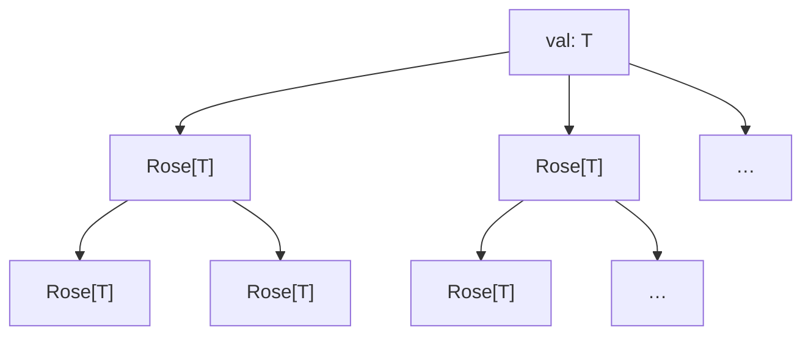
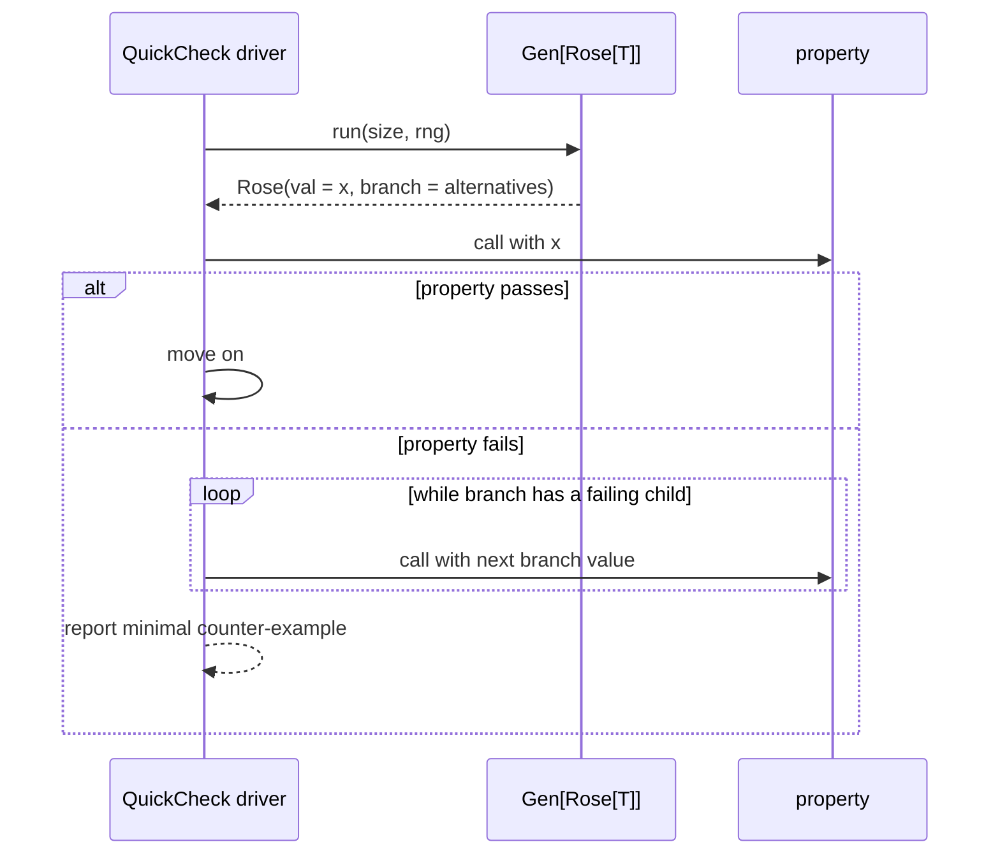

# Rose — Rose Trees for Integrated Shrinking

A tiny package: one data type plus the functor/monad toolkit (`pure`, `new`,
`fmap`, `bind`, `join`, `apply`). A **rose tree** is a node holding a value
together with a (possibly infinite) lazy iterator of children rose trees.
That's the data structure John Hughes used in the original QuickCheck to tie
*generation* and *shrinking* together — hence "integrated shrinking".

## The shape

```moonbit nocheck
pub(all) struct Rose[T] {
  val    : T
  branch : Iter[Rose[T]]
}
```



Every node carries *a candidate value* and *the strictly simpler variants we
could retreat to if this one falsifies a property*. When a QuickCheck property
fails on `rose.val`, the shrinker walks `rose.branch` looking for another
`val` that still fails — and repeats, following the child whose children are
even simpler. Because `branch` is `Iter`, sub-trees are generated on demand;
unexplored alternatives never allocate.

## Install

```bash
moon add moonbitlang/quickcheck
```

```json
{
  "import": [
    { "path": "moonbitlang/quickcheck/rose", "alias": "rose" }
  ]
}
```

---

## Building rose trees

`pure(x)` is a leaf: the value `x` with no alternatives. `new(val, branch)`
lets you attach any `Iter[Rose[T]]` of shrinks.

```mbt check
///|
test "pure is a leaf with no alternatives" {
  let leaf = @rose.pure(42)
  assert_eq(leaf.val, 42)
  assert_eq(leaf.branch.count(), 0)
}

///|
test "new attaches explicit shrinks" {
  let rose = @rose.new(
    3,
    [@rose.pure(0), @rose.pure(1), @rose.pure(2)].iter(),
  )
  assert_eq(rose.val, 3)
  let children = rose.branch.collect()
  assert_eq(children.length(), 3)
  assert_eq(children[0].val, 0)
  assert_eq(children[2].val, 2)
}
```

### Concrete example: integer shrinker

A standard QuickCheck "shrink towards 0" tree. Each node offers one
alternative — its half — and the tree walks all the way down to 0.

```mbt check
///|
fn shrink_int(n : Int) -> @rose.Rose[Int] {
  fn go(x : Int) -> @rose.Rose[Int] {
    if x == 0 {
      @rose.pure(0)
    } else {
      @rose.new(x, Iter::singleton(go(x / 2)))
    }
  }

  go(n)
}

///|
test "int shrinker halves towards 0" {
  let r = shrink_int(8)
  assert_eq(r.val, 8)
  // The single branch points to 4.
  let c1 = r.branch.head().unwrap()
  assert_eq(c1.val, 4)
  // …then 2.
  let c2 = c1.branch.head().unwrap()
  assert_eq(c2.val, 2)
  // …then 1, then 0 (a leaf).
  let c3 = c2.branch.head().unwrap()
  assert_eq(c3.val, 1)
  let c4 = c3.branch.head().unwrap()
  assert_eq(c4.val, 0)
  assert_eq(c4.branch.count(), 0)
}
```

---

## Rose is a monad

That's the integrated-shrinking trick: because `Rose` is a monad, every
generator written in a `Gen[Rose[T]]` style automatically produces not just
*a value* but *a tree of values and their shrinks*. No separate `Shrink`
instance needed.

| Operation | Signature | Meaning |
|-----------|-----------|---------|
| `pure(x)` | `T -> Rose[T]` | Leaf |
| `Rose::fmap(r, f)` | `Rose[T] -> (T -> U) -> Rose[U]` | Rename every node |
| `Rose::bind(r, f)` | `Rose[T] -> (T -> Rose[U]) -> Rose[U]` | Dependent substitution |
| `Rose::join(r)` | `Rose[Rose[T]] -> Rose[T]` | Flatten two levels |
| `Rose::apply(r, f)` | `Rose[T] -> ((T, Iter[Rose[T]]) -> Rose[T]) -> Rose[T]` | Inspect node + its branch |

### `fmap`

Maps `f` over every node in the tree. Structure is preserved.

```mbt check
///|
test "fmap relabels every node" {
  let r = @rose.new(
    2,
    [@rose.pure(0), @rose.pure(1)].iter(),
  )
  let doubled = r.fmap(x => x * 10)
  assert_eq(doubled.val, 20)
  let children : Array[Int] = doubled.branch.map(c => c.val).collect()
  assert_eq(children, [0, 10])
}
```

### `bind` / `join`

`bind` substitutes a tree at **every node** of the input; `join` is `bind`
with the identity — both collapse `Rose[Rose[T]]` into `Rose[T]`. The rule:
keep the outer root's own branches and *append* the inner tree's branches
after the new sub-trees.

```mbt check
///|
test "bind substitutes at every node" {
  let r = @rose.new(1, [@rose.pure(0)].iter())
  // For every node n, emit a Rose that also has "n - 1" as an alternative.
  let expanded = r.bind(n => @rose.new(
    n,
    if n == 0 { Iter::empty() } else { Iter::singleton(@rose.pure(n - 1)) },
  ))
  assert_eq(expanded.val, 1)
  // bind preserves the value; the tree gains new alternatives from f.
  let kids : Array[Int] = expanded.branch.map(c => c.val).collect()
  // First come the branches produced by `f(1)`: one alternative, 0.
  // Then come the original branches' fmapped forms: the leaf 0.
  assert_eq(kids, [0, 0])
}

///|
test "join flattens Rose[Rose[T]] into Rose[T]" {
  // Outer tree of Roses; the root already carries a Rose[Int].
  let inner = @rose.new(10, [@rose.pure(5)].iter())
  let outer : @rose.Rose[@rose.Rose[Int]] = @rose.new(
    inner,
    [@rose.pure(@rose.pure(7))].iter(),
  )
  let flat = outer.join()
  // The root value is the root of the inner Rose.
  assert_eq(flat.val, 10)
  // The joined branches are: (flattened outer siblings) ++ (inner's own
  // branches).
  let kids : Array[Int] = flat.branch.map(c => c.val).collect()
  assert_eq(kids, [7, 5])
}
```

### `apply`

A node-level escape hatch: inspect both the current value *and* its branches
and produce a replacement rose. Handy when you want to annotate, filter, or
decorate a generated tree.

```mbt check
///|
test "apply rewrites a single node" {
  let r = @rose.new(
    10,
    [@rose.pure(5), @rose.pure(0)].iter(),
  )
  // Collapse the tree: drop all branches, keep only the root.
  let collapsed = r.apply((v, _) => @rose.pure(v))
  assert_eq(collapsed.val, 10)
  assert_eq(collapsed.branch.count(), 0)
}
```

---

## How it plugs into QuickCheck



`Rose` itself doesn't talk to the driver — it's just the "shape of a
shrinkable value" data type. The actual driver lives in
`moonbitlang/quickcheck/falsify` (for internal shrinking) and in the main
`moonbitlang/quickcheck` package (for the classical external shrinker).

## When to use it directly

Most users never touch `Rose` — they derive `Shrink` or let the `falsify`
driver construct the tree for them. You'd reach for `Rose` directly when:

- Writing a custom `Gen[T]` with bespoke shrinking semantics.
- Testing your shrinker itself, where the tree shape matters.
- Porting Haskell/OCaml code that uses integrated shrinking.

## References

- Koen Claessen, John Hughes. _QuickCheck: a lightweight tool for random
  testing of Haskell programs._ ICFP 2000.
- Edsko de Vries. _falsify: Internal Shrinking Reimagined for Haskell._
  Haskell Symposium 2023. — The conceptual basis for the integrated-shrinking
  driver sitting on top of this module.

## License

Apache-2.0.
